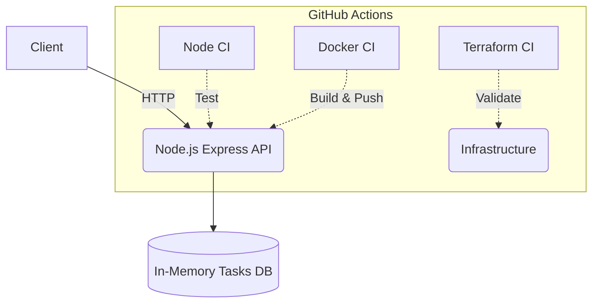

# DevOps Platform Challenge

## 📖 Project Purpose
This repository represents the final implementation of the Engineering Challenge. It features a complete Node.js REST API with automated CI/CD pipelines, Docker containerization, and Infrastructure as Code (IaC) validation using Terraform.

## 🏗️ Architecture



## 🚀 Local Setup

**Prerequisites:**
- Node.js (v18+)
- Docker
- Terraform (>= 1.5.0)

**Installation:**
```bash
git clone https://github.com/Tony83400/Challenge-platform-dev.git
cd Challenge-platform-dev
npm install
```

## 🧪 Tests
The application is tested using the native `node:test` runner combined with `supertest` for the API endpoints. The test suite covers all features (Tasks CRUD and total calculations).

```bash
# Run all automated tests
npm test
```

## 🐳 Docker Usage
The application is completely containerized.

```bash
# Build the image locally
docker build -t devops-platform-challenge .

# Run the container locally on port 3000
docker run --rm -p 3000:3000 devops-platform-challenge
```

## ⚙️ CI/CD Explanation
Our CI/CD workflows are orchestrated via GitHub Actions to ensure code quality and deployment readiness:
- **Node CI (`node-ci.yml`)**: Triggered on all Pull Requests and pushes to `main`. It sets up Node.js, installs dependencies, and runs our automated test suite.
- **Docker CI (`docker.yml`)**: Responsible for building the Docker image and pushing it to the GitHub Container Registry (GHCR) using a secure token.
- **Terraform Validation (`terraform.yml`)**: Runs exclusively when `.tf` files are modified, ensuring configuration syntax and formatting without requiring cloud deployment.

## ☁️ Terraform Explanation
The `terraform/` directory contains our Infrastructure as Code foundation.
Since this challenge requires no active cloud provider, we utilize Terraform strictly for local structural validation. The CI pipeline ensures that the code complies with Terraform's best practices by automatically executing:
- `terraform fmt -check`
- `terraform init`
- `terraform validate`

## 🔄 Development Workflow
We strictly adhere to a branch-based collaboration model to protect production (`main`):

1. **Create an Issue**: Using the predefined GitHub Issue templates (Bugs/Features).
2. **Branch Creation**: Follow our naming convention: `feature/...`, `fix/...`, `chore/...`.
3. **Commit**: Write descriptive and meaningful commits.
4. **Pull Request**: Open a PR using our Pull Request Template, referencing the original issue.
5. **Quality Gates**: A PR cannot be merged until all CI checks pass (Node, Terraform) and at least **1 teammate approval** is granted.
6. **Merge**: The code is integrated into `main`.

## 🛠️ Useful Commands

| Command | Description |
|---|---|
| `npm start` | Starts the Node.js API server on port 3000 |
| `npm test` | Executes the test suite |
| `docker build -t api .` | Builds the Docker image |
| `terraform -chdir=terraform validate` | Validates Terraform configuration locally |
