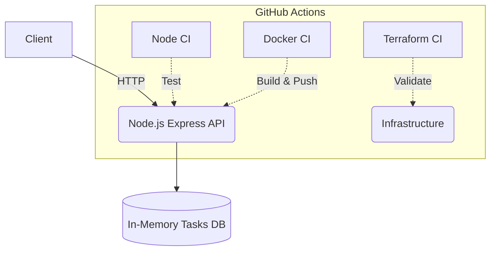

# DevOps Platform Challenge

## 📖 Project Purpose
This repository represents the final implementation of the Engineering Challenge. It features a complete Node.js REST API with automated CI/CD pipelines, Docker containerization, and Infrastructure as Code (IaC) validation using Terraform.

## Architecture



## Local Setup

**Prerequisites:**
- Node.js (v18+)
- Docker
- Terraform (>= 1.5.0)

**Installation:**
```bash
git clone https://github.com/Tony83400/Challenge-platform-dev.git
cd Challenge-platform-dev
npm install
```

## Tests
The application is tested using the native `node:test` runner combined with `supertest` for the API endpoints. The test suite covers all features (Tasks CRUD and total calculations).

```bash
# Run all automated tests
npm test
```

## Docker Usage
The application is completely containerized.

```bash
# Build the image locally
docker build -t devops-platform-challenge .

# Run the container locally on port 3000
docker run --rm -p 3000:3000 devops-platform-challenge
```

## CI/CD Explanation
Our CI/CD workflows are orchestrated via GitHub Actions to ensure code quality and deployment readiness:
- **Node CI (`node-ci.yml`)**: Triggered on all Pull Requests and pushes to `main`. It sets up a Node.js matrix (20 & 22), caches dependencies, runs ESLint, tests with native coverage, and audits dependencies.
- **Docker CI (`docker.yml`)**: Responsible for building the Docker image with multi-stage layers, caching via GitHub Actions cache, scanning for CVEs with Trivy, and pushing semver/latest tagged images to GHCR.
- **Terraform Validation (`terraform.yml`)**: Runs on `.tf` changes, verifying configuration syntax (`fmt`, `validate`), running TFLint, and conducting tfsec security audits.
- **Automated Release (`release.yml`)**: Triggers on version tags (`v*`) to automatically publish formal GitHub Releases with autogenerated release notes.

## Terraform Explanation
The `terraform/` directory contains our Infrastructure as Code foundation.
Since this challenge requires no active cloud provider, we utilize Terraform strictly for local structural validation. The CI pipeline ensures that the code complies with Terraform's best practices by automatically executing:
- `terraform fmt -check` (Format verification)
- `terraform init` (Provider initialization)
- `terraform validate` (Syntax & configuration validation)
- `tflint` (Advanced Terraform linter)
- `tfsec` (Static security scanner)

## Development Workflow
We strictly adhere to a branch-based collaboration model to protect production (`main`):

1. **Create an Issue**: Using the predefined GitHub Issue templates (Bugs/Features).
2. **Branch Creation**: Follow our naming convention: `feature/...`, `fix/...`, `chore/...`.
3. **Commit**: Write descriptive and meaningful commits.
4. **Pull Request**: Open a PR using our Pull Request Template, referencing the original issue.
5. **Quality Gates**: A PR cannot be merged until all CI checks pass (Node, Terraform) and at least **1 teammate approval** is granted.
6. **Merge**: The code is integrated into `main`.

## Useful Commands

| Command | Description |
|---|---|
| `npm start` | Starts the Node.js API server on port 3000 |
| `npm test` | Executes the test suite |
| `npm run test:coverage` | Runs tests and generates a native code coverage report |
| `npm run lint` | Runs ESLint on all codebase files |
| `npm run audit` | Runs dependency vulnerability audit |
| `docker build -t devops-platform-challenge .` | Builds the Docker image locally |
| `terraform -chdir=terraform validate` | Validates Terraform configuration locally |

## 🌟 Bonuses Implemented

Our platform incorporates **all 11 engineering bonuses** outlined in the challenge specifications:

1. **Node.js Dependency Vulnerability Scan**: CI job `audit` executes `npm audit --omit=dev --audit-level=high` to detect and block package vulnerabilities.
2. **Docker Vulnerability Scan**: Aqua Security Trivy scans built Docker images in `docker.yml` for OS and package CVEs (`CRITICAL,HIGH`).
3. **ESLint & Code Quality**: Modern flat configuration in `eslint.config.mjs` (`semi`, `quotes`, `no-unused-vars`) integrated as an automated pre-test quality gate.
4. **Automated Test Coverage**: Native Node test coverage via `npm run test:coverage` reaching **>98% code coverage** across all endpoints (`GET`, `POST`, `PATCH`, `DELETE`, `/health`, `/total`).
5. **Node.js Version Matrix**: Multi-version CI strategy running across Node.js LTS versions (Node 20 and Node 22) in parallel.
6. **Dependency Caching**: Configured `cache: npm` in Node CI and GitHub Actions layer caching (`type=gha,mode=max`) in Docker CI for lightning-fast pipeline runs.
7. **Non-Root Docker Execution**: The container drops privileges and runs securely under `USER node`.
8. **Multi-Stage & Minimal Docker Image**: Two-stage build (`builder` -> lightweight `alpine` runtime) minimizing attack surface and image footprint.
9. **Terraform Lint & Security Scanning**: Integrated `TFLint` for advanced syntax validation and `tfsec` for static security and compliance analysis in `terraform.yml`.
10. **Automated GitHub Release**: Dedicated workflow (`release.yml`) automatically creates GitHub Releases with release notes upon pushing git version tags (`v*`).
11. **Image Tagging from Git Tags**: Docker CI automatically generates Semantic Versioning tags (`type=semver`) in GHCR matching git release tags.
